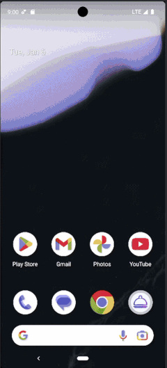

# Recipes App

Android-приложение для просмотра рецептов, разработанное с использованием **классической Android UI системы на XML**.
Проект демонстрирует создание Android-приложения с использованием **MVVM-архитектуры, локального хранения данных, сетевого слоя и Navigation Component**.

## ✨ Описание

- Главный экран с категориями блюд и навигацией
- Каталог рецептов (`RecyclerView`)
- Экран рецепта:
    - ингредиенты
    - `SeekBar` для изменения количества порций
    - автоматический пересчёт ингредиентов
- Избранные рецепты
- Локальное хранение данных
- Интерфейс в стиле Material Design

### Основные принципы

- разделение UI и бизнес-логики
- однонаправленный поток данных
- ViewModel управляет состоянием экранов
- Repository объединяет работу с API и локальным хранилищем

## 🛠️ Стек технологий

### UI / UX
- XML Layouts
- Material Design
- RecyclerView
- Fragment + Activity
- Jetpack Navigation Component
- Figma (дизайн-макеты)

### Архитектура
- MVVM
- ViewModel
- LiveData
- Repository Pattern

### Данные
- Retrofit
- OkHttp
- Room
- SharedPreferences
- Parcelable

### Инструменты
- Hilt (Dependency Injection)
- Glide (загрузка изображений)
- Git / Git Flow
- Pull Request + Code Review

## 🧑‍💻 Подход к разработке

- Feature-ветки под каждую задачу
- Осмысленные commit-сообщения
- Code review перед мержем
- Clean Code и Android best practices
- Код ориентирован на поддержку и масштабируемость
